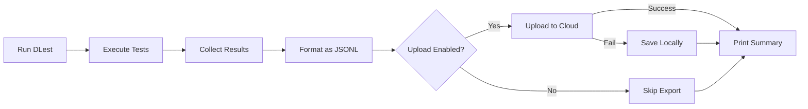

# Cloud Export

Export DLest test results to cloud storage (S3, Google Cloud Storage) in JSONL format for analysis and dashboards.

## Quick Start

### 1. Install Provider SDK

```bash
# For AWS S3
npm install --save-optional @aws-sdk/client-s3

# For Google Cloud Storage
npm install --save-optional @google-cloud/storage
```

### 2. Configure Export

#### Option A: Environment Variables (Recommended)

```bash
# Enable export
export DLEST_EXPORT_ENABLED=true
export DLEST_EXPORT_PROVIDER=s3

# S3 Configuration
export DLEST_EXPORT_S3_BUCKET=my-dlest-results
export DLEST_EXPORT_S3_REGION=us-east-1
export DLEST_EXPORT_S3_ACCESS_KEY_ID=AKIA...
export DLEST_EXPORT_S3_SECRET_ACCESS_KEY=...

# Optional: Customize file pattern
export DLEST_EXPORT_FILE_PATTERN="{date}/{runId}.jsonl"
```

#### Option B: Configuration File

```javascript
// dlest.config.js
module.exports = {
  export: {
    enabled: true,
    provider: 's3', // or 'gcs'

    s3: {
      bucket: 'my-dlest-results',
      region: 'us-east-1',
      pathPrefix: 'test-results'
    },

    fileNaming: {
      pattern: '{date}/{runId}.jsonl'
    }
  }
};
```

⚠️ **Security Warning**: Don't hardcode credentials in config files. Use environment variables or IAM roles in CI/CD.

### 3. Run Tests

```bash
npx dlest
```

Results will be automatically exported to your configured cloud storage.

## JSONL Format

Each exported file contains JSON Lines (JSONL) - one JSON object per line:

```jsonl
{"type":"run_metadata","runId":"20240127120000-abc123","timestamp":"...","git":{"branch":"main","commit":"ba8ec8a"},...}
{"type":"test","runId":"20240127120000-abc123","suite":"E-commerce","name":"product view","status":"passed","duration":1234,...}
{"type":"test","runId":"20240127120000-abc123","suite":"E-commerce","name":"add to cart","status":"failed","error":"...",...}
{"type":"run_summary","runId":"20240127120000-abc123","stats":{"total":10,"passed":8,"failed":2},...}
```

### Line Types

1. **`run_metadata`** (first line)
   - Run context: git info, environment, system details
   - Unique `runId` for this test run

2. **`test`** (one per test)
   - Test name, status (passed/failed), duration
   - DataLayer events captured during test (if enabled)
   - Error details and helpful tips (if failed)

3. **`run_summary`** (last line)
   - Aggregate statistics
   - Total duration

## Configuration

### File Naming Patterns

Available tokens:
- `{date}` - Date in YYYY-MM-DD format
- `{runId}` - Unique run ID
- `{branch}` - Git branch name
- `{commit}` - Git short commit hash
- `{env}` - Environment (ci, local, production)

Examples:
```javascript
fileNaming: {
  pattern: '{date}/{runId}.jsonl'
  // Result: 2024-01-27/20240127120000-abc123.jsonl

  pattern: '{branch}/{date}/{runId}.jsonl'
  // Result: main/2024-01-27/20240127120000-abc123.jsonl

  pattern: '{env}/{date}/{commit}-{runId}.jsonl'
  // Result: ci/2024-01-27/ba8ec8a-20240127120000-abc123.jsonl
}
```

### Include Options

Control what gets exported:

```javascript
export: {
  include: {
    testResults: true,      // Individual test results
    dataLayerEvents: true,  // DataLayer events per test
    networkRequests: true,  // Network requests (future)
    environment: true,      // Git, CI, system info
    config: false          // Config (credentials stripped)
  }
}
```

### Error Handling

```javascript
export: {
  failOnUploadError: false, // Don't fail tests if upload fails
  retries: 3,              // Retry attempts
  timeout: 30000           // Upload timeout (ms)
}
```

## Cloud Provider Setup

### AWS S3

#### Create S3 Bucket

```bash
aws s3 mb s3://dlest-test-results
```

#### IAM Policy (recommended for CI/CD)

```json
{
  "Version": "2012-10-17",
  "Statement": [
    {
      "Effect": "Allow",
      "Action": [
        "s3:PutObject",
        "s3:GetObject"
      ],
      "Resource": "arn:aws:s3:::dlest-test-results/*"
    }
  ]
}
```

#### Environment Variables

```bash
export DLEST_EXPORT_S3_BUCKET=dlest-test-results
export DLEST_EXPORT_S3_REGION=us-east-1
export DLEST_EXPORT_S3_ACCESS_KEY_ID=AKIA...
export DLEST_EXPORT_S3_SECRET_ACCESS_KEY=...
```

### Google Cloud Storage

#### Create GCS Bucket

```bash
gsutil mb gs://dlest-test-results
```

#### Service Account

Create a service account with `Storage Object Admin` role:

```bash
gcloud iam service-accounts create dlest-exporter
gcloud projects add-iam-policy-binding PROJECT_ID \
  --member="serviceAccount:dlest-exporter@PROJECT_ID.iam.gserviceaccount.com" \
  --role="roles/storage.objectAdmin"

gcloud iam service-accounts keys create key.json \
  --iam-account=dlest-exporter@PROJECT_ID.iam.gserviceaccount.com
```

#### Environment Variables

```bash
export DLEST_EXPORT_GCS_BUCKET=dlest-test-results
export DLEST_EXPORT_GCS_PROJECT_ID=my-project
export DLEST_EXPORT_GCS_CREDENTIALS_PATH=./key.json
```

## CI/CD Integration

### GitHub Actions

```yaml
name: DLest Tests

on: [push, pull_request]

jobs:
  test:
    runs-on: ubuntu-latest

    steps:
      - uses: actions/checkout@v3

      - name: Setup Node
        uses: actions/setup-node@v3
        with:
          node-version: 18

      - name: Install dependencies
        run: |
          npm install
          npm install --save-optional @aws-sdk/client-s3

      - name: Run DLest tests
        env:
          DLEST_EXPORT_ENABLED: true
          DLEST_EXPORT_PROVIDER: s3
          DLEST_EXPORT_S3_BUCKET: ${{ secrets.DLEST_S3_BUCKET }}
          DLEST_EXPORT_S3_REGION: us-east-1
          DLEST_EXPORT_S3_ACCESS_KEY_ID: ${{ secrets.AWS_ACCESS_KEY_ID }}
          DLEST_EXPORT_S3_SECRET_ACCESS_KEY: ${{ secrets.AWS_SECRET_ACCESS_KEY }}
        run: npx dlest
```

### GitLab CI

```yaml
test:
  stage: test
  image: node:18
  script:
    - npm install
    - npm install --save-optional @aws-sdk/client-s3
    - npx dlest
  variables:
    DLEST_EXPORT_ENABLED: "true"
    DLEST_EXPORT_PROVIDER: "s3"
    DLEST_EXPORT_S3_BUCKET: "$DLEST_S3_BUCKET"
    DLEST_EXPORT_S3_REGION: "us-east-1"
    DLEST_EXPORT_S3_ACCESS_KEY_ID: "$AWS_ACCESS_KEY_ID"
    DLEST_EXPORT_S3_SECRET_ACCESS_KEY: "$AWS_SECRET_ACCESS_KEY"
```

## Querying Results

### Download and Parse JSONL

```bash
# Download from S3
aws s3 cp s3://dlest-test-results/test-results/2024-01-27/xyz.jsonl .

# Parse with jq
cat xyz.jsonl | jq .

# Filter failed tests
cat xyz.jsonl | jq 'select(.type == "test" and .status == "failed")'

# Get summary
cat xyz.jsonl | jq 'select(.type == "run_summary")'
```

### BigQuery (for GCS)

Load JSONL files into BigQuery for analysis:

```sql
CREATE OR REPLACE EXTERNAL TABLE `project.dataset.dlest_results`
OPTIONS (
  format = 'NEWLINE_DELIMITED_JSON',
  uris = ['gs://dlest-test-results/test-results/*.jsonl']
);

-- Query failed tests
SELECT
  runId,
  suite,
  name,
  error,
  tip
FROM `project.dataset.dlest_results`
WHERE type = 'test' AND status = 'failed'
ORDER BY timestamp DESC;
```

### Athena (for S3)

```sql
CREATE EXTERNAL TABLE dlest_results (
  type STRING,
  runId STRING,
  suite STRING,
  name STRING,
  status STRING,
  duration INT,
  error STRING,
  tip STRING
)
ROW FORMAT SERDE 'org.openx.data.jsonserde.JsonSerDe'
LOCATION 's3://dlest-test-results/test-results/';

SELECT * FROM dlest_results WHERE status = 'failed';
```

## Troubleshooting

### Upload Fails

If upload fails, DLest saves results locally:
```
.dlest-cache/failed-exports/export-{timestamp}.json
```

You can manually retry uploads or debug issues.

### Credentials Invalid

Check environment variables:
```bash
echo $DLEST_EXPORT_S3_ACCESS_KEY_ID
echo $DLEST_EXPORT_S3_BUCKET
```

Verify IAM permissions:
```bash
aws s3 ls s3://dlest-test-results/
```

### Module Not Found

Install the required provider SDK:
```bash
npm install --save-optional @aws-sdk/client-s3
# or
npm install --save-optional @google-cloud/storage
```

## Security Best Practices

1. **Never commit credentials** to git
2. **Use environment variables** in CI/CD
3. **Use IAM roles** when running in AWS (EC2, Lambda, ECS)
4. **Use service accounts** when running in GCP (GCE, Cloud Run)
5. **Rotate credentials** regularly
6. **Limit permissions** to specific buckets only

## Example Workflow



## Need Help?

- Check [GitHub Issues](https://github.com/metricasboss/dlest/issues)
- See [examples](../examples/export)
- Read [API documentation](./API.md)
